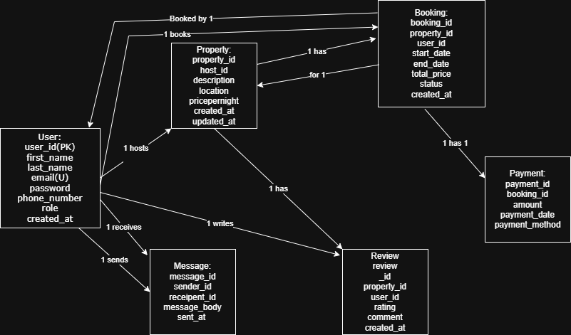

🚀 ### 🎨ERD (Entity-Relationship Diagram)

### Entities:

1. **User**
2. **Property**
3. **Booking**
4. **Payment**
5. **Review**
6. **Message**

📦 Data Models & Schemas

1. 👤 User

| Attribute       | Type                           | Constraints                 |
| --------------- | ------------------------------ | --------------------------- |
| `user_id`       | UUID (Primary Key, Indexed)    | Required                    |
| `first_name`    | VARCHAR                        | NOT NULL                    |
| `last_name`     | VARCHAR                        | NOT NULL                    |
| `email`         | VARCHAR                        | UNIQUE, NOT NULL            |
| `password_hash` | VARCHAR                        | NOT NULL                    |
| `phone_number`  | VARCHAR                        | Optional                    |
| `role`          | ENUM(`guest`, `host`, `admin`) | NOT NULL                    |
| `created_at`    | TIMESTAMP                      | Default: CURRENT\_TIMESTAMP |

🔐 Constraints
- Unique email addresses.
- Role strictly defined as guest, host, or admin.

2. 🏠 Property
   
| Attribute       | Type                        | Constraints                   |
| --------------- | --------------------------- | ----------------------------- |
| `property_id`   | UUID (Primary Key, Indexed) | Required                      |
| `host_id`       | UUID (Foreign Key)          | References `User(user_id)`    |
| `name`          | VARCHAR                     | NOT NULL                      |
| `description`   | TEXT                        | NOT NULL                      |
| `location`      | VARCHAR                     | NOT NULL                      |
| `pricepernight` | DECIMAL                     | NOT NULL                      |
| `created_at`    | TIMESTAMP                   | Default: CURRENT\_TIMESTAMP   |
| `updated_at`    | TIMESTAMP                   | On Update: CURRENT\_TIMESTAMP |

🔐 Constraints
- Each property must be associated with a host (User with role host).
- Essential fields must be populated.

3. 📅 Booking

| Field        | Type      | Constraints                                               |
|--------------|-----------|-----------------------------------------------------------|
| booking_id   | UUID      | Primary Key, Indexed                                      |
| property_id  | UUID      | Foreign Key → Property(property_id), NOT NULL             |
| user_id      | UUID      | Foreign Key → User(user_id), NOT NULL                     |
| start_date   | DATE      | NOT NULL                                                  |
| end_date     | DATE      | NOT NULL                                                  |
| total_price  | DECIMAL   | NOT NULL                                                  |
| status       | ENUM      | ('pending', 'confirmed', 'canceled'), NOT NULL            |
| created_at   | TIMESTAMP | DEFAULT CURRENT_TIMESTAMP                                 |

🔐 Constraints
- Valid foreign keys to Property and User.
- Status must strictly follow defined ENUM values.

4. 💳 Payment
   
| Attribute        | Type                                    | Constraints                      |
| ---------------- | --------------------------------------- | -------------------------------- |
| `payment_id`     | UUID (Primary Key, Indexed)             | Required                         |
| `booking_id`     | UUID (Foreign Key)                      | References `Booking(booking_id)` |
| `amount`         | DECIMAL                                 | NOT NULL                         |
| `payment_date`   | TIMESTAMP                               | Default: CURRENT\_TIMESTAMP      |
| `payment_method` | ENUM(`credit_card`, `paypal`, `stripe`) | NOT NULL                         |

🔐 Constraints
- Every payment must be linked to a valid booking.
- Payment method must be clearly specified.

5. ⭐ Review
   
| Attribute     | Type                        | Constraints                         |
| ------------- | --------------------------- | ----------------------------------- |
| `review_id`   | UUID (Primary Key, Indexed) | Required                            |
| `property_id` | UUID (Foreign Key)          | References `Property(property_id)`  |
| `user_id`     | UUID (Foreign Key)          | References `User(user_id)`          |
| `rating`      | INTEGER                     | CHECK: `1 <= rating <= 5`, NOT NULL |
| `comment`     | TEXT                        | NOT NULL                            |
| `created_at`  | TIMESTAMP                   | Default: CURRENT\_TIMESTAMP         |

🔐 Constraints
- Valid rating: 1 to 5.
- Users must provide a comment.

6. 💬 Message
   
| Attribute      | Type                        | Constraints                 |
| -------------- | --------------------------- | --------------------------- |
| `message_id`   | UUID (Primary Key, Indexed) | Required                    |
| `sender_id`    | UUID (Foreign Key)          | References `User(user_id)`  |
| `recipient_id` | UUID (Foreign Key)          | References `User(user_id)`  |
| `message_body` | TEXT                        | NOT NULL                    |
| `sent_at`      | TIMESTAMP                   | Default: CURRENT\_TIMESTAMP |

🔐 Constraint
- Messaging only occurs between valid users

🔄 Relationships & ER Diagram Summary
- One User (host) ➝ Many Properties
- One Property ➝ Many Bookings, Reviews
- One Booking ➝ One Payment
- One User ➝ Many Messages (as sender/recipient)

🧠 Indexing Strategy
To optimize performance for querying and searching:

✅ Primary Keys on all tables (indexed automatically).
📌 Indexes:
- Email on User table for login performance
- Property_id on Property and Booking tables
- Booking_id on Booking and Payment tables

🧪 Data Integrity & Business Rules
- Only users with the role host can list properties
- Booking dates must not overlap with confirmed bookings
- Users can only review properties they’ve booked
- Payments must be completed for a booking to be confirmed

🔐 Security Notes
- Passwords must be hashed using a secure algorithm 
- Email validation and phone verification are recommended
- Role-based access control (RBAC) should be implemented to restrict actions by role
